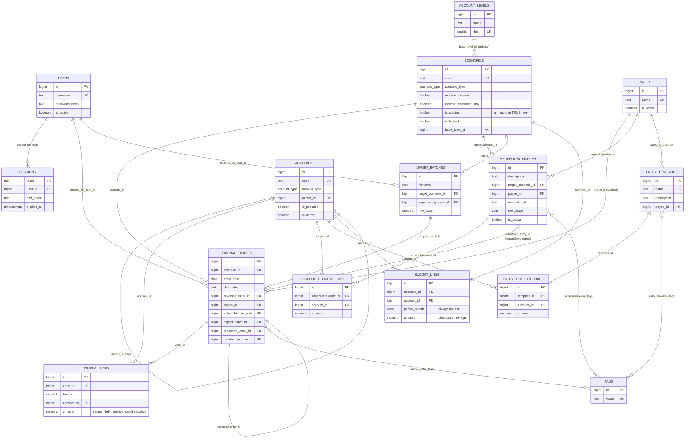

# Schema reference

`db/schema.sql` is the single source of truth — this document is a map of
it, not a replacement for reading it. Every table/trigger/view below is
named exactly as it appears there; grep the name if you want the real
definition and the comment explaining it. For *why* the schema is shaped
this way, see [`SPEC.md`](../SPEC.md) — this document is the *what*, SPEC
is the *why*.

## Entity-relationship diagram

Attributes shown are the ones that matter for understanding the shape —
primary keys, foreign keys, and the handful of columns that drive
behavior (booleans triggers check, the signed `amount`, ...). The full
column list for every table is in the [table-by-table reference](#table-by-table-reference)
below. Three tag junction tables (`journal_entry_tags`,
`scheduled_entry_tags`, `entry_template_tags`) are collapsed into the
`}o--o{` many-to-many lines rather than drawn as boxes — each is just the
two foreign keys, nothing else.

## Two shapes of scenario, side by side

The single fact that governs half the schema: **a scenario is either a
full ledger or an income-statement-only budget grid, never both**, and
which one it is decides what table can even reference it.

|                          | Full scenario (ACTUAL, STAGING, a real forecast/what-if) | Income-statement-only scenario (a budget) |
|--------------------------|------------------------------------------------------------|--------------------------------------------|
| `scenarios.income_statement_only` | `FALSE` | `TRUE` |
| Where its data lives     | `journal_entries` / `journal_lines`, same as ACTUAL | `budget_lines` |
| What it can touch        | Any account, any type — a real double-entry record of (or projection of) actual transactions | Postable income/expense accounts only |
| Does it need to balance? | `enforce_balance` decides (ACTUAL is always `TRUE`) | N/A — a budget line has no counter-entry, nothing to balance by construction |
| Does it have a date?     | Yes — `journal_entries.entry_date`, one specific day | No — just `period_month`, a whole calendar month |
| Can you edit a posted value? | No — journal lines are immutable; fix mistakes with a reversing entry | Yes — a budget number is a working assumption, not a legal record; `budget_lines` rows are UPSERTed in place |
| Enforced by              | `fn_income_statement_only_guard` (blocks `journal_entries` INSERT) | `fn_budget_line_guard` (blocks `budget_lines` INSERT/UPDATE unless the scenario says `income_statement_only`) |
| App screen               | Journal (`/entries`) | Budget (`/budget`) |

Both guard triggers run `BEFORE INSERT` regardless of which client is
writing — psql, the app, a future importer. See `SPEC.md` decision 3 for
the reasoning behind keeping these as two disjoint tables instead of one
table with nullable columns.

## Default scenarios: ACTUAL and STAGING

Every fresh database (`db/seed.sql`) starts with exactly three scenario
rows: `ACTUAL`, `STAGING`, and one starter budget (`BUD2026`). Two of
those three are not ordinary user-created scenarios:

- **ACTUAL** is *the books*. `scenario_type = 'actual'` is locked to
  `enforce_balance = TRUE` and `income_statement_only = FALSE` by two
  CHECK constraints (`actual_must_balance`,
  `actual_not_income_statement_only`) — no combination of app bug or
  direct SQL can turn ACTUAL into a scenario that accepts an unbalanced
  or budget-shaped entry.
- **STAGING** is a holding pen, not a budget concept — a real full
  scenario (`income_statement_only = FALSE`, `enforce_balance = TRUE`)
  whose `scenarios.is_staging` column is `TRUE`. That flag does two
  things: `fn_staging_manual_entry_guard` rejects any `journal_entries`
  INSERT into it unless `scheduled_entry_id IS NOT NULL` or
  `import_batch_id IS NOT NULL` — a Staging entry can only ever be the
  by-product of one of Staging's two producers (`materialize_due_
  schedules()`'s copies, or a CSV import — see `import_batches`), never
  typed in from New entry — and `uq_one_staging_scenario`, a unique index
  on `is_staging` filtered to true rows, caps this at one scenario, ever.
  The app looks it up by the flag (`SELECT id FROM scenarios WHERE
  is_staging`) rather than a hardcoded code string, so renaming it in the
  UI can't silently break scheduling the way it used to.

  Approving one or more pending entries (the Staging page, `/staging`,
  checkboxes + "Approve entries") posts a *second*, independent entry
  into the entry's resolved target scenario — the schedule's
  `target_scenario_id` or the import batch's `target_scenario_id`,
  whichever is set (an entry only ever has one), falling back to ACTUAL
  if somehow neither is — and sets the original's `promoted_entry_id` to
  link them; the staged copy is never edited or deleted, just marked.
  Re-approving an already-promoted entry is rejected in the app layer
  (`promoted_entry_id IS NOT NULL` check); nothing currently doing that
  at the trigger level, since editing/deleting a `journal_entries` row is
  already generally forbidden (integrity trigger 3) regardless of
  scenario.

  A CSV import (`/import`) round-trips `/entries/export.csv`'s own column
  layout — `Entry #` groups rows back into one entry (the value itself
  isn't kept as a real id), everything else lines up 1:1 — so export →
  edit in a spreadsheet → re-import is a real workflow. Every group is
  fully validated in Python (`_parse_csv_import()`: a real account code,
  exactly one of Debit/Credit per row, the group nets to zero) *before*
  anything touches the database; rows that fail are reported back by
  original CSV row number and never create a partial entry. Unlike a
  schedule, the target scenario for a whole batch is chosen on the import
  form itself, not read from the file's own `Scenario` column — an
  uploaded CSV is not a trusted source for "which scenario this becomes
  real books in."

**Neither default scenario is otherwise protected from editing, and
neither needs to be**: there is no scenario *edit* route in the app at
all — `POST /scenarios` only creates, and `POST
/scenarios/{id}/toggle-lock` only flips `is_locked`. Every scenario,
default or user-created, is immutable after creation through the UI,
full stop. (There's no delete route either — a scenario with any history
is meant to stay in the list, same as an account you deactivate instead
of removing.) Locking ACTUAL or STAGING the same way you'd lock any
other scenario is possible and occasionally useful (e.g. freezing ACTUAL
during a month-end close) — it just isn't special to those two codes.
Neither `is_staging` nor `income_statement_only` is exposed as a
checkbox on the "New scenario" form — both describe a structural role
that (by design, enforced by `uq_one_staging_scenario` for the former)
only ever applies to a seeded row, not something a user creates more of.

## Integrity triggers, in commit order

Everything below is `db/schema.sql`, numbered there as "Integrity
trigger N" comments — this is that list, in one place:

1. **`fn_entry_balanced`** (`DEFERRABLE INITIALLY DEFERRED`, fires at
   COMMIT) — every touched `journal_entries` row must have at least one
   line, and if its scenario's `enforce_balance` is true, `SUM(amount) =
   0` across its lines. This is the one deferred trigger in the schema;
   everything else fires immediately.
2. **`fn_line_account_guard`** (`journal_lines`, BEFORE INSERT) — a line's
   account must be a true leaf (`is_postable`) unless the entry's scenario
   has a `base_level_id` and the account sits exactly at that depth, and
   the account must be active.
3. **`fn_lines_immutable`** (`journal_lines`, BEFORE UPDATE OR DELETE) —
   always raises. **`fn_entries_guard`** (`journal_entries`, BEFORE UPDATE
   OR DELETE) — DELETE always raises; UPDATE raises unless only
   `description`/`reference` changed.
4. **`fn_scenario_lock_guard`** (`journal_entries`, BEFORE INSERT) — no
   new entries once `scenarios.is_locked`.
5. **`fn_income_statement_only_guard`** (`journal_entries`, BEFORE INSERT)
   — no entries at all once `scenarios.income_statement_only`.
6. **`fn_staging_manual_entry_guard`** (`journal_entries`, BEFORE INSERT)
   — once `scenarios.is_staging`, an entry may only land here with
   `scheduled_entry_id IS NOT NULL` or `import_batch_id IS NOT NULL` —
   never a manual posting.
7. **`fn_budget_line_guard`** (`budget_lines`, BEFORE INSERT OR UPDATE) —
   the mirror image of 2/4/5/6 for the other table: scenario must be
   `income_statement_only` and unlocked, account must be a postable
   income/expense account.

Plus two more scoped to `accounts`: **`fn_account_hierarchy_guard`**
(child's `account_type` must match its parent's; the parent chain must
be acyclic) fires on `accounts` INSERT/UPDATE, not on the ledger tables
at all.

## Reporting layer (views and functions)

These exist so "if a number matters, SQL should be able to compute it" —
every one is callable identically from the app, `psql`, or a BI tool.

| Object | Shape | Purpose |
|---|---|---|
| `v_dim_account` | view | Every account with its full `path`, `depth`, `sort_path`, and derived `normal_side` — the recursive CTE that makes the tree queryable without walking `parent_id` by hand. |
| `v_fact_lines` | view | One row per journal line, fully denormalized (scenario, account, payee, tags, `month`). The star schema's fact table. |
| `v_monthly_activity` | view | `v_fact_lines` pre-aggregated to account × month × scenario — the budget-vs-actual base for BI tools that don't want to aggregate 3M rows themselves. |
| `v_dim_date` | view | A plain date dimension, 2020–2035, for BI tools that want one. |
| `fn_trial_balance(scenario, as_of, from)` | function | Every postable account with activity in the window — the literal Trial Balance report's data source, filtered (unlike `fn_account_balances` below). |
| `fn_account_balances(scenario, as_of, from)` | function | Every *active* account's own direct balance, unconditionally — no postable/has-activity filtering. The base the app's Python-side account-tree rollup (Trial Balance, Balance Sheet, the Budget page's Actual column) builds subtotals from; a summary account needs a row here even at $0 so it can be positioned in the tree. |
| `fn_rollup_balance(scenario, depth, as_of)` | function | Balances rolled up to a common `account_levels` depth — lets a scenario posted straight to "Bank" line up against one that split Checking/Savings. Backs the Variance page. |

## Table-by-table reference

Grouped the way `db/schema.sql` groups them.

### Auth
- **`users`** — `username` (lowercase, unique), `password_hash` (bcrypt,
  the only form a password ever takes in SQL), `is_active`.
- **`sessions`** — `token` (opaque random string, the primary key itself
  — no separate id), `user_id`, `csrf_token`, `expires_at`. A row *is* a
  login; deleting it *is* a logout.

### Chart of accounts
- **`account_levels`** — a name for a depth (`"Top Level Accounts"` =
  depth 1, ...), purely a label over `accounts.parent_id`'s existing
  hierarchy. Used only to give a scenario's `base_level_id` and the
  Accounts page's level browser something human-readable to point at.
- **`accounts`** — `code` (3–8 digits, unique — the natural key used in
  every URL/filter/CSV, not the surrogate `id`), `account_type`,
  `parent_id` (self-referencing tree), `is_postable` (leaf vs. summary),
  `is_active`, `currency` (defaulted, not yet used for conversion — see
  SPEC's extension roadmap).

### Scenarios
- **`scenarios`** — see [the table above](#two-shapes-of-scenario-side-by-side)
  for `enforce_balance`/`income_statement_only`; also `scenario_type`
  (a label, doesn't drive any trigger), `is_locked`, `base_level_id`
  (optional — lets this scenario post to a whole branch instead of every
  leaf under it, additive only).

### People and organization
- **`payees`** — `name` (unique), `is_active`. One per entry (a plain FK
  on `journal_entries`, not a junction table) — unlike tags, a posting
  has exactly one payee or none.
- **`tags`** — `name` (lowercase, validated character set), many-to-many
  with entries/schedules/templates via three junction tables
  (`journal_entry_tags`, `scheduled_entry_tags`, `entry_template_tags`).
  Deliberately *not* covered by the immutability trigger — tags are
  metadata about an entry, not part of the accounting fact, so re-tagging
  a posted entry is fine.

### The ledger itself
- **`journal_entries`** — the header: `scenario_id`, `entry_date`,
  `description`, `reference`, `payee_id`, plus three self-referencing
  columns that thread together the append-only/reversal/scheduling
  story: `reverses_entry_id` (this entry reverses that one — see the
  `uq_one_reversal_per_entry` partial unique index: at most one reversal
  per entry), `scheduled_entry_id` (this is a materialized occurrence of
  that schedule, sitting in STAGING), `promoted_entry_id` (once approved,
  the id of the *real* entry this staged one was copied into — NULL
  means still pending). `created_by_user_id` for the audit trail.
- **`journal_lines`** — the fact table. `entry_id`, `line_no`,
  `account_id`, and the canonical **signed** `amount` (debit > 0,
  credit < 0, never zero); `debit`/`credit` are `GENERATED ALWAYS ...
  STORED` from `amount`, so the two-column presentation exists
  everywhere without ever being able to disagree with the number that
  actually governs balance.

### Planning
- **`budget_lines`** — the income-statement-only counterpart to the
  ledger: `scenario_id`, `account_id`, `period_month` (always the 1st,
  CHECK-enforced), `amount` (a plain positive target — no debit/credit
  sign to juggle, unlike everything above). Unique on the triple, so a
  grid cell is a straight UPSERT.

### Recurrence, import, and reuse (none of these is a posting on its own)
- **`scheduled_entries`** + **`scheduled_entry_lines`** — a template plus
  a recurrence rule (`interval_unit`/`interval_count`/`next_date`).
  Lines carry the same signed-`amount`/generated-`debit`/`credit` shape
  as `journal_lines`. `materialize_due_schedules()` copies a due
  schedule's lines into a brand new `journal_entries` row in Staging —
  the schedule row itself never becomes ledger data.
- **`import_batches`** — one row per CSV upload (`/import`): `filename`,
  `target_scenario_id` (chosen on the import form, not read from the
  file), `imported_by_user_id`, `row_count` (how many entries actually
  landed in Staging, which can be less than the file's own row count —
  see `journal_entries.import_batch_id`). No lines table of its own: a
  batch's entries are ordinary `journal_entries`/`journal_lines` rows in
  Staging, just tagged with which batch produced them.
- **`entry_templates`** + **`entry_template_lines`** — same shape minus
  the recurrence columns; scaffolding for "New entry"'s Load Template
  picker. Loading one only fills the form client-side (`entry_templates.js`)
  — nothing is tracked once loaded, same as if you'd typed it by hand.

## Naming conventions worth knowing

- `fn_*` — a trigger function or a callable reporting function.
- `trg_*` — the trigger itself (always `fn_<same-name-minus-trg-prefix>`
  as its function, e.g. `trg_scenario_lock_guard` →
  `fn_scenario_lock_guard`).
- `v_*` — a view, always read-only, always meant for BI/reporting
  consumption as much as the app.
- `idx_*` — an index; a name tells you the table and the columns.
- `uq_*` — a unique index doing constraint duty (`uq_one_reversal_per_entry`)
  rather than a plain `UNIQUE` column constraint, because the rule it
  enforces is conditional (`WHERE reverses_entry_id IS NOT NULL`).
